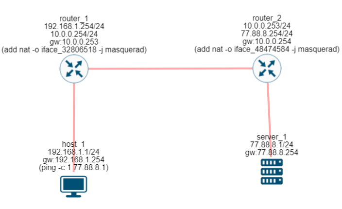
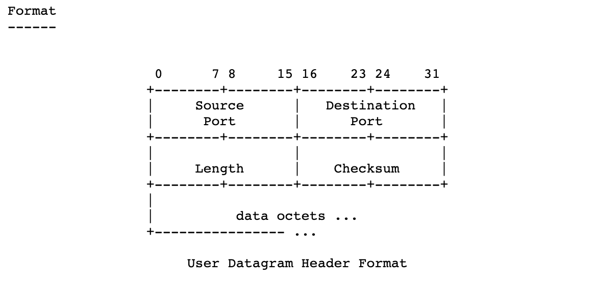

# Networking fundametals 

# Data Link Layer

If the physical layer converts all data into signals and transmits them over optical fiber, then the data link layer is needed so that this data can be oriented within a single **network segment**.

A **network segment** is a physically limited area of a network between two devices (where a host is connected to a router or directly to another host).

At this layer, the main players are **MAC addresses**. They are used to exchange packets between host-to-host, host-to-router, and router-to-router devices, **that is, devices directly connected** to each other via **Wi-Fi or cable** (even if the IP address is known, it is impossible to transmit packets without a MAC address, because the host will not know which device to send them to)!

Types of MAC addresses:

* **Unicast** — a personal MAC address. Every network card has such an address. It is either programmed directly at the factory or installed together with the drivers.

* **Broadcast** — a broadcast MAC address, represented as all bits set to 1, or in hexadecimal format as FF:FF:FF:FF:FF:FF. Such an address in the destination field means that the packet must be processed by all hosts that receive this packet.

# Network Layer

## IP Address & IP Networks

An IP address is a universal identifier in a network, a field consisting of 4 bytes separated by dots (it is unique for each device).

* 0.0.0.0
* 192.16.0.1

*To optimize network address space, subnet masks were introduced.*

Let us agree that:

1. An IP address is not the same as an IP network.

An **IP network** is a collection of IP addresses that has a specific range of IP addresses depending on the subnet mask (and, accordingly, its notation format) within a single network segment.

**A router has some characteristics of a switch specifically in terms of combining devices into a single local segment** with a common network mask. The difference is that a router additionally provides a "gateway" for access to other networks (the Internet), while a switch cannot do this.

A subnet mask is needed to identify the network itself and the hosts within it.

For example:

* 172.16.0.0 — this is the IP network address
* 172.16.0.1 — an IP address (usually the router's address)
* 172.16.0.2 ~ 172.16.255.255 — IP addresses (addresses that hosts can use)

*As you can see, the first two bytes do not change (172.16), because they identify the network itself (that is, the network address).*

A subnet mask is a sequence of 32 bits that identifies the network.

172.16.0.1 /16 — if you add the first two bytes (172.16), you get 16 bits (since one byte contains **8 bits**). Another notation format that is often encountered is 255.255.0.0 (decimal). The first bits are set to 1 (the subnet), while the remaining bits are 0 (hosts within the subnet). The notation 255.255.255.0 corresponds to the first 24 bits being ones (that is, /24), while 255.0.0.0 corresponds to 8 one-bits (that is, /8).

*/16 is the number of one-bits in the subnet mask. Without the slash signs. For example, the mask 255.255.240.0 is /20 (11111111.11111111.11110000.00000000).*

## ARP

The ARP protocol is used to determine the recipient's MAC address based on its IP address. It operates on a **request-response** principle. When sending a request, the value of the **THA** field is set to FF:FF:FF:FF:FF:FF. Due to broadcasting, this request is received by all devices located within the same network segment. After receiving the request, the destination host compares the IP address in the request with its own IP address. If they match, it generates a reply containing its MAC address (otherwise, the request is ignored).

After learning the recipient's MAC address, the sender host stores it in its cache.

| IP Address | MAC Address | Dynamic/Static |
| ---------- | ----------- | -------------- |

*Dynamic entries are typically stored for about 40 seconds and are removed after expiration.*

| Field   | Purpose                 | Notes                          |
| ------- | ----------------------- | ------------------------------ |
| **SHA** | Sender's MAC address    | -                              |
| **SPA** | Sender's IP address     | -                              |
| **THA** | Recipient's MAC address | Field value: FF:FF:FF:FF:FF:FF |
| **TPA** | Recipient's IP address  | -                              |

Packet transmission within a single network segment occurs as follows:

1. Before sending packets, Host_1 checks its ARP cache for the recipient's MAC address. If it is not present, Host_1 sends an ARP request.
2. Host_2 compares the IP address in the request. If the address belongs to it, it sends a reply containing its MAC address.
3. Host_1 stores the MAC address in its cache and sends packets using that MAC address.

## Packet Transmission Between Different Network Segments

**Host_1 --- Router --- Host_2**

Host_1 and Host_2 are located in different network segments. For Host_2 to receive packets, Host_1 must direct the traffic to the Router, thereby transferring responsibility for further delivery to it. However, hosts do not have an understanding of the network topology, so they do not know what exists beyond the router. This is where the routing table becomes useful. Routing tables exist on both hosts and routers.

A routing table has two columns:

**Destination IP** → **Router IP**

The host compares the IP address from the packet header with the **Destination IP** column in the routing table to determine the corresponding **Router IP**, which belongs to a device capable of forwarding the data to the recipient.

*Usually this is either the host itself or the router to which it is connected.*

1. Before sending packets, the sending host checks the routing table.
2. If the sender and recipient are located within the same network segment, the packets are sent directly (1) or (m).
3. If the sender and recipient are located in different network segments, the **Router IP** field in the sender's routing table will contain the IP address of the router to which the host is connected (2).
4. The sending host then checks the routing table again to find a path to the router itself.
5. Since the sending host and the router are directly connected, step 2 is performed.

| Destination IP |  Router IP |
| :------------: | :--------: |
|       ...      |     ...    |
|  (1) 10.0.0.2  |  10.0.0.1  |
| (m) 10.0.0.100 |  10.0.0.1  |
| (2) 172.16.0.3 | 10.0.0.100 |

If the number of connected IP networks becomes too large, adding a new entry (n.n.n.n → router IP) for every new network would overload the routing table. To solve this, the following changes were introduced.

1. Within a single network segment, when packets are sent directly, the **network address itself** is used as the destination instead of individual host IP addresses: **10.0.0.0/24**. This entry covers all hosts that belong to that network.

2. During inter-network communication, all traffic **must pass through a router**. Therefore, instead of having dozens of entries with the same router IP but different destination addresses, a single entry is used where the destination is **0.0.0.0/0**. This entry matches all IP networks except the local network, automatically forwarding traffic along a predefined route.

*This type of entry is called the **default route**.*

|        Destination IP       |  Router IP |
| :-------------------------: | :--------: |
| 0.0.0.0/0 (default gateway) | 10.0.0.100 |
|       (1) 10.0.0.0/24       |  10.0.0.1  |
|             ...             |     ...    |

host_1(ip:10...) --- router1 (ip:192.168.1.0) --- router2 --- router3 (ip:172.16.12.0) --- host_2 (ip:169...)

The default route merely transfers responsibility, which is why there are routers that know routes to all networks. This area is known as the **Default-Free Zone (DFZ)**.

For such a network to function, Router_2 must have information about the networks 10.0.0.0/24 and 169.254.1.0/24.

| Destination IP | Router IP     |
| -------------- | ------------- |
| 192.168.1.0/24 | 192.168.1.102 |
| 172.16.12.0/24 | 172.16.12.102 |
| 10.0.0.0/24    | 192.168.1.101 |
| 169.254.1.0/24 | 172.16.12.103 |

## NAT Masquerading

> IP addresses can be divided into two types:
>
> * **Private addresses** — addresses used exclusively within local networks.
> * **Public addresses** — addresses used on the global Internet.

NAT technology is used to replace a private IP address with a public IP address. When a router receives packets from the local network for transmission, it replaces the sender's IP address with its own external IP address and stores this mapping. When a reply arrives, the reverse translation is performed.

This is necessary to optimize the global IP address space, since the number of IP addresses is limited. Instead of assigning a unique public address to every device, a public address is assigned to the home router (by the ISP), while a separate local address space is created for connected devices. Within this local network, specially reserved private IP ranges are used for routing. It is this technology that allows a local network to communicate with the global Internet.

*Some examples of private IP address ranges are omitted here.*

Host --- (private IP space) --- Router --- (public IP space) --- ISP

Routers with NAT functionality can be arranged in a chain, in which case the sender's IP address in the original packet may be modified multiple times.

1. Initially, a packet is sent from Host_1 (sender IP address: 192.168.1.1).
2. As it passes through Router_1, its source IP address is changed to 10.0.0.254 because NAT is enabled on that router.
3. As it passes through Router_2, its source IP address is changed to 77.88.8.254.
4. As a result, Server_1 receives the ICMP request with a source IP address of 77.88.8.254.

Typically, Masquerading is implemented using a combination of the sender's IP address and port number. After replacing the sender's IP address with its own public address, the router also extracts the sender's port from the TCP/UDP header and combines them as shown below. It then assigns a random port to the public address to avoid collisions.

192.168.1.102:32768 → 216.58.209.174:80

77.79.176.6:55000 = 192.168.1.102:32768

216.58.209.174:80 → 77.79.176.6:55000

Reverse translation to:

192.168.1.102:32768

*This is necessary so that during reverse translation, the router can correctly determine which device should receive the response.*

# Transport Layer

This layer is responsible for delivering data between the applications (services) of the sender and the recipient. A host may run hundreds of services simultaneously, and in order to direct data to the correct application (identify it), **PORTS** are used. A port is a data entry/exit point and has a range of up to 2 bytes in size.

1. A single port can be listened to by no more than one service at a time.
2. A single service can use multiple ports.

* **Privileged ports** — from 0 to 1023. These ports can only be opened by an administrator or superuser.
* **User ports** — from 1024 to 65,535. These ports can be opened by a regular user.

*As a result, the combination of an IP address and a port number, for example 192.168.1.100:80, identifies a specific application on a specific host. This combination is also referred to as a **socket**.*

UDP - Fast, without prior connection establishment; packets may be lost.

TCP - Reliable, with no packet loss and optimal speed, but slower than UDP.
 
 ### State Flags

| Flag | Meaning                                                                                                                  |
| ---- | ------------------------------------------------------------------------------------------------------------------------ |
| URG  | Indicates that the **Urgent Pointer** field contains a valid value and that the data in the segment is high-priority.    |
| ACK  | Indicates that the **Acknowledgment Number** field is in use and contains the sequence number of the next expected byte. |
| PSH  | Indicates that the data should be immediately delivered to the application layer (program) rather than buffered.         |
| RST  | Forces a connection reset or termination.                                                                                |
| SYN  | Synchronizes **Sequence Numbers** between the sender and receiver.                                                       |
| FIN  | Indicates that the sender has finished transmitting data and wishes to close the connection.                             |

### Connection Establishment

Before data can be transmitted, a connection must be established between the applications to ensure that both sides are ready to send and receive data. Without this connection, data transmission cannot begin. This process is known as the **three-way handshake**.

*TCP Connection Establishment*

1. The client sends a packet with the **SYN** flag set in the TCP header.
2. Upon receiving it, the server generates a response with the **SYN + ACK** flags set.
3. In the final stage, the client receives the **SYN + ACK** response and replies with an **ACK** flag.

*Case where the destination port is closed*

1. The client sends a TCP packet with the **SYN** flag set.
2. Since the required port is closed on the server, the server responds with the **RST** flag.

*Case where no response is received*

In this case, the client does not receive any response and assumes that the packets may have been lost in transit. As a result, it retries several times with increasing time intervals between attempts.

### Connection Termination

After all data has been transmitted, the connection must be closed. It cannot simply be left open. The following sequence occurs:

Client → (FIN + ACK)

Server → (ACK)

Server → (FIN + ACK)

Client → (ACK)

After sending all packets, the client initiates connection termination by sending a close request. However, there are situations where the server has not yet finished sending its own data while the client is still able to receive it. In this case, the server first responds with an **ACK** flag. Only after the server has finished transmitting all remaining data does it send its own **FIN + ACK** packet to request connection closure.

### Sequence Number and Acknowledgment Number

The **Sequence Number** and **Acknowledgment Number** fields are responsible for reliable, lossless data delivery. When TCP receives data for transmission, it divides the data into multiple segments (a byte stream or byte array). After a connection is established, these segments are sent to the recipient. Upon receiving a segment, the recipient generates a response with the **ACK** flag set to acknowledge receipt and allow the exchange to continue.

* **Sequence Number** — this field allows the receiver to correctly reassemble received segments (packets), since packets may arrive out of order. It contains the byte offset of the first byte of data carried by the segment within the overall data stream (therefore, the first segment carries the value 0 because it represents the beginning of the data stream). Based on the Sequence Number, the receiver places data in the appropriate location within its buffer, leaving space for segments that have not yet arrived or have arrived out of order, and eventually reconstructs the original data in the correct sequence.

* **Acknowledgment Number** — a field used in ACK responses. It is used to confirm receipt of data and contains the sequence number of the next expected byte (+1) since the beginning of the connection. If a segment arrives out of order, this value does not advance and continues to indicate the next byte expected in sequence.

*If the sender does not receive an ACK response from the receiver, it will attempt to retransmit the packets after waiting for several seconds.*

1. Client ------ SYN (Ack=0, Seq=0) -----> Server
2. Server ------ SYN + ACK (Seq=0, Ack=1) -----> Client
3. Client ------ ACK (Ack=1, Seq=1) -----> Server
4. Client ------ PUSH (Ack=1, Seq=1, Size=1000) -----> Lost
5. Client ------ PUSH (Ack=1, Seq=1001, Size=800) -----> Lost
6. Client ------ PUSH (Ack=1, Seq=1801, Size=1000) -----> Server
7. Server ------ ACK (Ack=1, Seq=1) -----> Client (the Ack field remains equal to the value established during connection setup)

The client receives an ACK packet again with **Ack=1**. This indicates that the first data segment was not received successfully and must be retransmitted.

### Additional Details

During connection establishment, the receiving host informs the sender about the amount of free space available in its buffer using the **Window** field. If sufficient space is available, the sender can transmit multiple segments of the data stream without waiting for an ACK response after each segment.

When the buffer becomes full, the value of the **Window** field is reduced to zero. Upon receiving such an ACK response, the sender stops transmitting data and waits until it receives another ACK indicating that buffer space has become available again. To prevent buffer overflow and efficiently utilize network resources, various congestion-control algorithms were developed.

*First, the time required to receive a response to a transmitted packet is called the **Round-Trip Time (RTT)**. Generally, the higher this value, the more congested the network path or receiver buffer is likely to be.*

As a result, the data transmission rate in TCP is controlled by several factors:

* The **Window** size (available receiver buffer space).
* The **RTT** value.
* The **Congestion Window (cwnd)**, which determines how many packets may be sent without waiting for acknowledgments.

Together, these parameters form the basis of TCP congestion-control algorithms, which dynamically adjust the transmission rate according to current network conditions and the receiver's ability to process incoming data.

## ICMP

ICMP (**Internet Control Message Protocol**) is a protocol used to detect and report various network errors. It operates on top of the IP protocol at the **Network Layer**.

The ICMP header contains several important fields:

* **Type** — indicates the general category of the problem or message.
* **Code** — specifies the exact error or condition within that category.
* **Internet Header + 64 bits of Original Datagram Data (ODD)** — may contain part of the original packet that encountered a problem during transmission. This allows the sender to determine which packet triggered the ICMP message.

ICMP is commonly used by network diagnostic tools such as:

* **ping** — uses ICMP Echo Request and Echo Reply messages to verify host reachability.
* **traceroute/tracert** — uses ICMP messages generated by routers to determine the path packets take through the network.

Unlike TCP or UDP, ICMP does not transport application data. Its primary purpose is to provide feedback about the status of packet delivery and network conditions.

| Type=Code | Reason                               | Description                                                                                                                                                                                                                                                          |
| :-------: | ------------------------------------ | -------------------------------------------------------------------------------------------------------------------------------------------------------------------------------------------------------------------------------------------------------------------- |
|    3=0    | Network Unreachable                  | This one is self-explanatory.                                                                                                                                                                                                                                        |
|    3=1    | Host Unreachable                     | Occurs when the destination host is not connected to the network.                                                                                                                                                                                                    |
|    3=2    | Protocol Unreachable                 | A relatively rare case.                                                                                                                                                                                                                                              |
|    3=3    | Port Unreachable                     | TCP can indicate when a port is closed and an application is not ready to receive data. UDP cannot do this itself, so ICMP is used to report the condition.                                                                                                          |
|    3=4    | Fragmentation Needed but DF Flag Set | Occurs when a router needs to fragment a packet, but the **Don't Fragment (DF)** flag prevents fragmentation. The packet is discarded, and the router generates an ICMP message.                                                                                     |
|    11=0   | Time Exceeded in Transit             | If the **TTL** field reaches 0 before the packet reaches its destination, the router reports the condition using ICMP.                                                                                                                                               |
|    11=1   | Fragment Reassembly Time Exceeded    | The receiver was unable to reassemble all packet fragments within the required time limit.                                                                                                                                                                           |
|    5=0    | Redirect for Network                 | A router informs a host that a better route exists for reaching a particular network.                                                                                                                                                                                |
|    5=1    | Redirect for Host                    | A router informs a host that a better route exists for reaching a specific destination host.                                                                                                                                                                         |
|    4=0    | Source Quench (Deprecated)           | Historically used when a host or router could not process packets quickly enough, usually due to buffer overflow or congestion, and requested that the sender reduce its transmission rate. This message type is now obsolete and no longer used in modern networks. |
